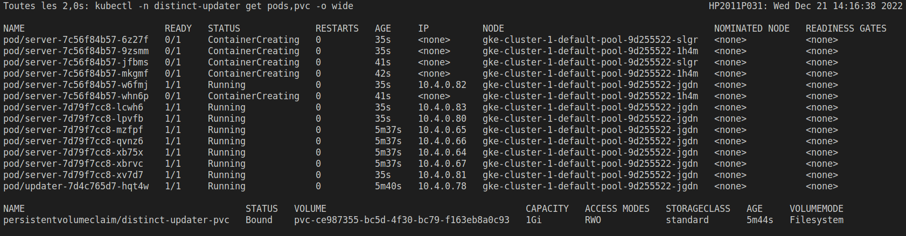
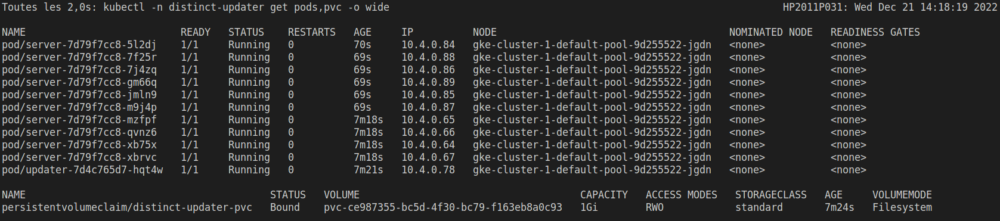

# side-updater - partage d'un volume par des déploiements distincts (ReadWriteOnce vs ReadWriteMany)

## Principe

* [manifest/base/deployment-server.yaml](manifest/base/deployment-server.yaml) définit un conteneur servant le dossier `/usr/share/nginx/html` avec `nginx`
* [manifest/base/deployment-loop.yaml](manifest/base/deployment-loop.yaml) définit un conteneur générant régulièrement `/usr/share/nginx/html/index.html` contenant la date courante.
* [manifest/base/pvc.yaml](manifest/base/pvc.yaml) permet de commander le volume correspondant à `/usr/share/nginx/html`
* [manifest/base/service.yaml](manifest/base/service.yaml) permet de tester l'application sur http://localhost:8888/ avec :

```bash
kubectl -n distinct-updater port-forward svc/distinct-updater 8888:80
```

Il convient de se préparer psychologiquement à un résultat impressionnant :


## Quelques tests...

### Problème avec la base et l'utilisation de ReadWriteOnce

Avec la classe "standard" de GKE :

```bash
kubectl create namespace distinct-updater
kubectl -n distinct-updater apply -k distinct-updater/manifest/base
kubectl -n distinct-updater scale deployment/server --replicas=10
```

...on note que les Pods se placent aléatoirement et que le démarrage de certains échoue :



> `kubectl -n distinct-updater describe pod/updater-7d4c765d7-t8l2w`
> Multi-Attach error for volume "pvc-031456d9-59c2-4997-bbf5-1161fad275ba" Volume is already used by pod(s) server-7c56f84b57-6zq5s, server-7c56f84b57-6kvzc


### Forcer l'exécution des Pod sur le même Node pour pouvoir utiliser ReadWriteOnce

Avec [manifest/affinity/deployment-server.yaml](manifest/affinity/deployment-server.yaml), on ajoute une `podAffinity` pour forcer les Pods "server" à se placer sur le même `Node` que le `Pod` "updater" :

```bash
kubectl create namespace distinct-updater
kubectl -n distinct-updater apply -k distinct-updater/manifest/affinity
kubectl -n distinct-updater scale deployment/server --replicas=10
```

On note que les Pods se placent bien sur le même Node :



**Cette approche peut permettre de décomposer une application en plusieurs déploiement même en présence d'un volume ReadWriteOnce partagés**


### Permettre l'exécution sur plusieurs Node avec des volumes ReadWriteMany

En présence d'une classe de stockage supportant `ReadWriteMany`, ce problème ne se pose plus.

Voir :

* [manifest/longhorn/pvc.yaml](manifest/longhorn/pvc.yaml) s'appuyant sur longhorn
* [manifest/gke-rwx/pvc.yaml](manifest/gke-rwx/pvc.yaml) s'appuyant sur "Cloud Filestore API" et le "Pilote CSI Filestore" de GKE


